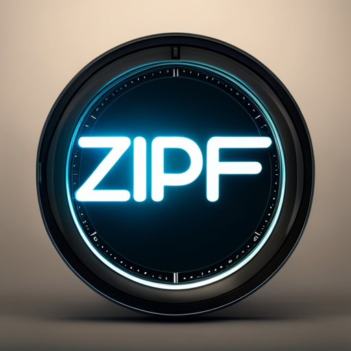

<h1 align="center">
  
</h1>
<p align="center">
  <i>Bring Context to your Foundational Workflows</i>
</p>

<p align="center">
    <a href="https://github.com/spacemanidol/zipfai/releases">
       Releases
    </a>
    <a href="https://www.python.org/">
            
    </a>
    <a href="https://github.com/spacemanidol/zipfai/blob/master/LICENSE">
        License
    </a>
</p>

<h4 align="center">
    <p>
        <a href="#shield-installation">Installation</a> |
        <a href="#fire-quickstart">Quickstart</a> |
    <p>
</h4>


## :shield: Installation

```bash
pip install zipfai
```

## :fire: Quickstart 

This is a small example on how you can add context to your prompts
```python
import zipfai
```

📜 Checkout [citations](./references.md) for related publications.

